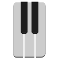

MidiKiti
========



A simple, but effective, software kit for making a MIDI Controller. Works with Teensy devices (more for the raw power, rather than a specific software requirement).

You also need to make sure the build flag is set for your Teensy. An example can be found in this repos platform.io

```ini
build_flags = -D USB_MIDI_SERIAL
```

## Features

- Modular design structure allows for custom controller layouts with any mix of objects without extra work. Just create the objects and start the runtime.
- Simple objects for building many common objects
    - `mk::Octave`
    - `mk::Pot`
    - `mk::Button`
- Supports local and I2C extensions of additional controls without needing to upload new software to the controler.
- Qt python interface for modifying parameters on the fly. You can change the MIDI CC of a slider, the threshold for sending events, and more. This is extra useful for tuning the electronics in noisey or less-reliable parts.

## Simple Example

```cpp
#include "mk_controller.h"
#include "mk_command.h"
#include "mk_button.h"
#include "mk_pot.h"

mk::MidiCommander *commander = nullptr;

// MIDI event-making devices
mk::MidiPot *slider = nullptr;
mk::MidiButton *button_1 = nullptr;
mk::MidiButton *button_2 = nullptr;

// The controller
mk::MidiController *controller = nullptr;

void setup()
{
    // We send messages over the Serial
    Serial.begin(9600);

    // see github.com/mccartnm/lutil for more
    lutil::Processor::get().init();

    // Queues all interface events for the controller
    command = new mk::MidiCommander();

    // A modulation slider
    mk::MidiPot::Config pot_config;
    pot_config.pin = 19;
    pot_config.control = 1;
    pot_config.low = 15;
    pot = new mk::MidiPot(pot_config, command);

    // A couple buttons

    mk::MidiButton::Config b1_config;
    b2_config.pin = 12;    // Hardware pin
    b1_config.control = 5; // The MIDI CC
    button_1 = mk::MidiButton(b1_config, command);

    mk::MidiButton::Config b2_config;
    b2_config.pin = 13;      // Hardware pin
    b2_config.control = 76;  // The MIDI CC
    b2_config.toggle = true; // This is a togglable button
    b2_config.ledPin = A3;   // If we have an LED pin for this button
    button_1 = mk::MidiButton(b2_config, command);
    
    mk::MidiController::Config con_config;
    con_config.midi_channel = 1;
    controller = new mk::MidiController(con_config);
    controller->add_local(command);
}

void loop()
{
    // Everything happens in this event loop.
    lutil::Processor::get().process();
}
```